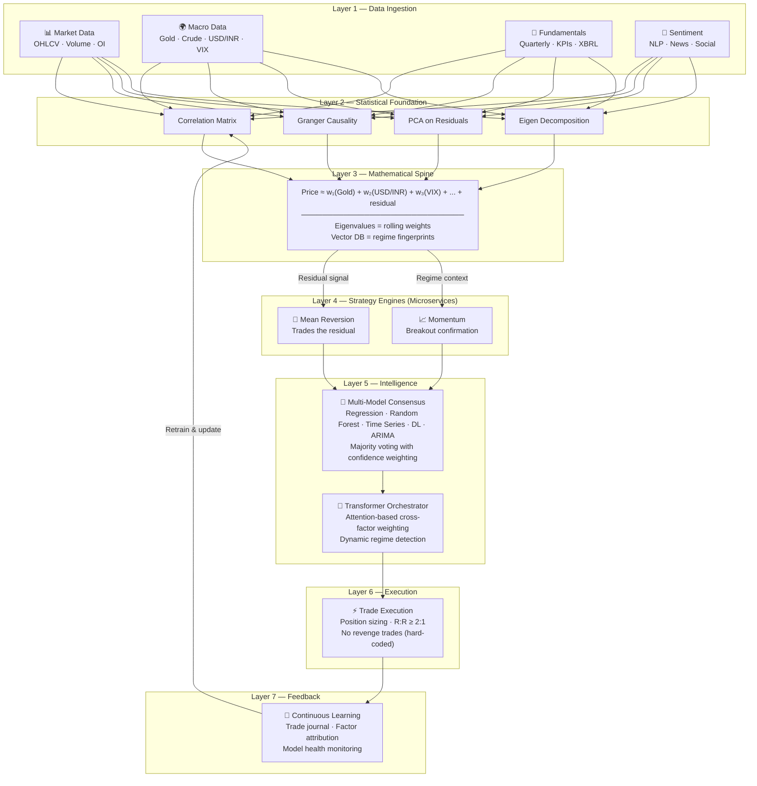
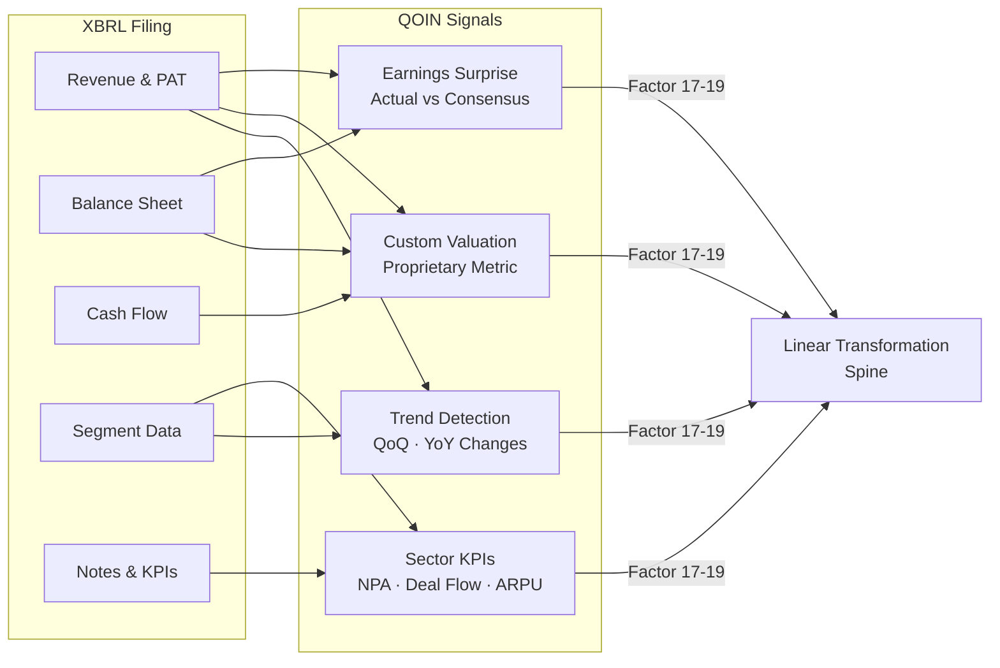
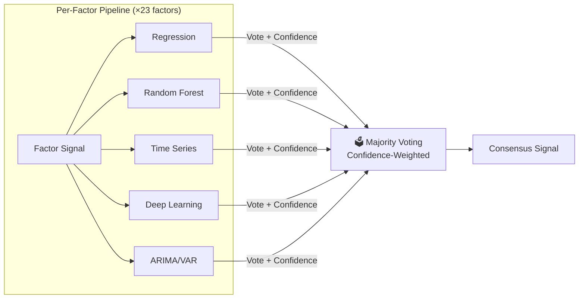
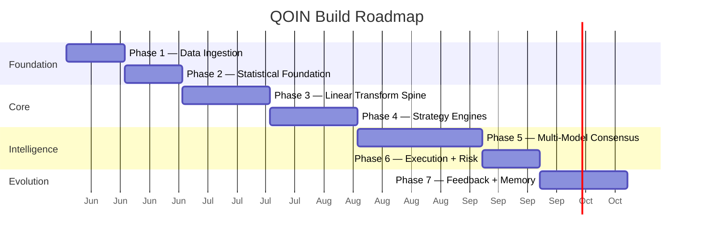

<div align="center">

# 🧠 QOIN

### **Quantitative Optimized Indian Nifty Strategy**

*A multi-factor, multi-model quantitative trading system for Indian equity intraday markets*

[]()
[]()
[]()
[]()
[]()

---

**QOIN is not a prediction engine. It's a probability machine.**

The objective is not to predict tomorrow's price — it's to predict tomorrow's *distribution* (mean, variance, shape) given 23 factor states, and trade when real price deviates into the tails.

</div>

---

## 📐 Core Thesis

```
Intraday trading is zero-sum minus fees.
The game is not being correct — it's being in the winning group.

55% win rate × 2:1 reward-to-risk = consistent profitability.

Every component in QOIN is evaluated through one lens:
Does it improve win rate, improve R:R ratio, or both?
If neither — it doesn't go in the model.
```

---

## 🏗️ System Architecture

QOIN is built as a **microservices architecture** — each factor pipeline and strategy engine is independently deployable and loosely coupled. A **transformer-based orchestrator** uses attention mechanisms to dynamically weigh which factors matter most in the current regime.



---

## 🧮 The Mathematical Spine

The backbone of QOIN is a **linear transformation model** — price expressed as a weighted sum of factors plus a residual:

```
Price = w₁(Gold) + w₂(Crude) + w₃(USD/INR) + w₄(VIX) + w₅(FII/DII) + ... + ε
         ↑           ↑            ↑              ↑           ↑                  ↑
    eigenvalue   eigenvalue   eigenvalue     eigenvalue   eigenvalue         RESIDUAL
    (rolling)    (rolling)    (rolling)      (rolling)    (rolling)        ← trade signal
```

| Component | What It Does | Why It Matters |
|-----------|-------------|----------------|
| **Eigenvalues** | Rolling weights from covariance matrix decomposition | Each factor's importance adapts over time (90-day window) |
| **Residual (ε)** | Gap between factor-predicted price and actual price | **This is the primary trade signal** — when ε exceeds 2 SD, mean reversion triggers |
| **Vector DB** | Stores daily factor-weight fingerprints | Regime similarity search: "today looks like these 5 historical days" |
| **Multi-TF** | Decomposition across 5m, 15m, 1H, 4H, daily | Captures both micro-structure and macro-regime dynamics |

### The Key Insight

> **We don't predict price. We predict the distribution.**
>
> The 23 factors project a probability distribution — mean, variance, and shape.
> A calm day produces a narrow distribution (tight SD bands). A chaotic day produces a wide one.
> The same ₹40 move away from mean is a **strong signal** on calm days and **meaningless** on volatile days.
> Projecting the full distribution captures this. Projecting just price misses it.

---

## 📊 Factor Registry

23 factors across 5 categories, to be statistically reduced to ~4-5 composite signals via correlation matrix + Granger causality + PCA.

### Macro Factors

| # | Factor | Role | Data Source |
|---|--------|------|-------------|
| 1 | Gold | Global macro driver, risk sentiment | API / yfinance |
| 2 | Crude Oil | Energy cost, inflation pressure | API / yfinance |
| 3 | USD/INR | Currency impact on FII flows | API / yfinance |
| 4 | India VIX | Volatility regime detection | NSE |
| 5 | FII/DII Flows | Institutional positioning | NSE (end-of-day) |
| 6 | Indian Bond Yields | Rate environment, RBI signal | RBI / Trading APIs |
| 7 | US Treasury Yields | Global rate benchmark | FRED / yfinance |
| 8 | Trade Deficit | Macro economic backdrop | Govt. data |
| 9 | GDP / GDP per Capita | Structural growth signal | RBI / MOSPI |
| 10 | RBI Monetary Policy | Repo rate, CRR, OMO decisions | RBI announcements |
| 11 | CPI / WPI Inflation | Rate decision driver | MOSPI |

### Market Factors

| # | Factor | Role | Data Source |
|---|--------|------|-------------|
| 12 | Nifty / Sector Indices | Market and sector regime | NSE |
| 13 | Options Chain OI Data | Max pain, PCR, unusual OI | NSE / Broker API |

### Technical Factors

| # | Factor | Role | Data Source |
|---|--------|------|-------------|
| 14 | Volume | Participation and conviction | Kite API / yfinance |
| 15 | RSI + Custom Technicals | Extension measurement (to be replaced) | Computed |
| 16 | OHLCV Multi-Timeframe | Price structure across 5m → Daily | Kite API / yfinance |

### Fundamental Factors

| # | Factor | Role | Data Source |
|---|--------|------|-------------|
| 17 | Earnings Surprise vs Consensus | Beat/miss impact | **XBRL filings** + analyst data |
| 18 | Custom Valuation Metric | Proprietary (under development) | Computed |
| 19 | Stock-Specific KPIs | NPA (banks), deal flow (EPC), etc. | **XBRL filings** + annual reports |

### Sentiment

| # | Factor | Role | Data Source |
|---|--------|------|-------------|
| 20 | News Sentiment (NLP) | Market mood scoring | ET Markets, Moneycontrol |
| 21 | Social Sentiment | Retail positioning indicator | Reddit, Twitter/X |
| 22 | Global Cues: US Fed | Rate decision impact | Fed announcements |
| 23 | Global Cues: China PMI / Japan Yen | Cross-border macro shocks | Trading APIs |

---

## 📁 XBRL Data Collection

QOIN ingests **XBRL (eXtensible Business Reporting Language)** filings from Indian companies for fundamental analysis. These are structured financial reports filed with MCA (Ministry of Corporate Affairs) and available through the XBRL India repository.

```
data/
├── xbrl/
│   ├── raw/                          # Raw XBRL instance documents (.xml)
│   │   ├── RELIANCE_Q3_2025.xml
│   │   ├── HDFCBANK_Q3_2025.xml
│   │   └── ...
│   ├── parsed/                       # Extracted structured data (.json)
│   │   ├── financials/               # Revenue, PAT, EBITDA, EPS
│   │   ├── kpis/                     # Sector-specific: NPA, deal flow, ARPU
│   │   └── metadata/                 # Filing dates, periods, taxonomy refs
│   ├── consensus/                    # Analyst consensus estimates
│   │   └── earnings_estimates.csv    # For surprise calculation
│   └── pipeline/
│       ├── xbrl_parser.py            # Parse raw XBRL → structured JSON
│       ├── kpi_extractor.py          # Extract sector-specific KPIs
│       ├── surprise_calculator.py    # Actual vs consensus → surprise score
│       └── valuation_engine.py       # Custom valuation metric (WIP)
```

### What We Extract from XBRL



### XBRL Sources

| Source | URL | What It Provides |
|--------|-----|------------------|
| MCA XBRL Repository | `mca.gov.in/xbrl` | Quarterly/annual filings for all listed companies |
| NSE Corporate Filings | `nseindia.com` | Earnings announcements, board meeting outcomes |
| BSE Corporate Actions | `bseindia.com` | Results, dividends, splits |
| XBRL India Taxonomy | `xbrl.org/india` | Standard tags for Indian financial reporting |

---

## 🔄 Multi-Model Consensus

Each factor gets **5 independent models**. No single model is trusted — majority rules.



> **Design decision:** This is majority consensus, NOT "trust the best model."
> Each model sees the same data through a different mathematical lens.
> If 4/5 say bullish, that's the signal — regardless of which one disagrees.
> Confidence weighting means a unanimous low-confidence vote ≠ unanimous high-confidence vote.

---

## 🛡️ Risk Architecture

```
┌─────────────────────────────────────────────────────────┐
│                    HARD-CODED RULES                      │
│                  (No discretion allowed)                  │
│                                                          │
│  ■ Minimum R:R ratio: 2:1                               │
│  ■ Max daily loss cap: defined at market close           │
│  ■ No revenge trades: system blocks re-entry after loss  │
│  ■ Brokerage filter: min move must exceed ₹50-70 cost   │
│  ■ Position sizing: calculated from current capital      │
│  ■ Stop loss: placed at entry, never moved against trade │
│                                                          │
│  "You decide the rules when the market is closed and     │
│   you're thinking clearly. During market hours, you      │
│   just execute what the system says."                    │
└─────────────────────────────────────────────────────────┘
```

---

## 🏗️ Build Phases



| Phase | Name | Description | Status |
|-------|------|-------------|--------|
| 1 | **Data Ingestion** | Clean pipelines for all 23 factors via yfinance, Kite API, NLP scrapers | 🔲 Not started |
| 2 | **Statistical Foundation** | Correlation matrix, Granger causality, PCA, eigen decomposition | 🔲 Not started |
| 3 | **Linear Transformation Spine** | Factor model, rolling eigenvalues, vector DB, multi-TF decomposition | 🔲 Not started |
| 4 | **Strategy Engines** | Mean reversion (primary) + Momentum (secondary), paper trading | 🔲 Not started |
| 5 | **Multi-Model Consensus** | 5 models per factor, majority voting, transformer orchestrator | 🔲 Not started |
| 6 | **Execution & Risk** | Zerodha Kite integration, position sizing, anti-revenge-trade rules | 🔲 Not started |
| 7 | **Feedback & Memory** | Trade journal, factor attribution, continuous model retraining | 🔲 Not started |

---

## 🤝 Team Architecture

QOIN is built by a human-AI collaborative team with clear role boundaries:

```
┌──────────────────────────────────────────────────────────────┐
│                                                              │
│   Claude ──── Strategy architect, system design, research    │
│                                                              │
│   ChatGPT ─── ML model design, feature engineering           │
│                                                              │
│   Grok ────── Math model design, statistical validation      │
│                                                              │
│   Human ───── Builder, executor, final decision authority    │
│               Python · APIs · Cloud · GPU infrastructure     │
│                                                              │
└──────────────────────────────────────────────────────────────┘
```

---

## 📂 Project Structure

```
qoin/
├── README.md
├── docs/
│   ├── QOIN_Blueprint_v1.docx         # Architecture blueprint
│   └── changelog.md                    # Version history
├── data/
│   ├── market/                         # OHLCV, volume, OI
│   ├── macro/                          # Gold, crude, USD/INR, VIX, FII/DII
│   ├── xbrl/                           # XBRL filings and parsed data
│   ├── sentiment/                      # NLP-scored news and social
│   └── vectors/                        # Vector DB factor fingerprints
├── src/
│   ├── ingestion/                      # Phase 1: data pipelines
│   ├── stats/                          # Phase 2: correlation, granger, PCA
│   ├── spine/                          # Phase 3: linear transform, eigen
│   ├── engines/
│   │   ├── mean_reversion/             # Phase 4: primary strategy
│   │   └── momentum/                   # Phase 4: secondary strategy
│   ├── models/                         # Phase 5: ML model zoo
│   ├── orchestrator/                   # Phase 5: transformer / ensemble
│   ├── execution/                      # Phase 6: Kite integration, risk
│   └── feedback/                       # Phase 7: trade journal, retraining
├── notebooks/                          # Research and exploration
├── tests/                              # Unit + integration tests
└── config/
    ├── factors.yaml                    # Factor registry and metadata
    └── risk_params.yaml                # Risk rules and limits
```

---

## 🔑 Key Design Principles

| Principle | Implementation |
|-----------|---------------|
| **Math first, ML second** | Linear model must prove edge before ML layers on top |
| **Majority consensus, not best model** | 5 models vote per factor — democratic, not monarchic |
| **Trade the residual, not the prediction** | Mean reversion fires when price deviates from factor-predicted distribution |
| **Rolling, not fixed** | Eigenvalue weights recalculate on 60-90 day trailing window |
| **Per-stock factor relationships** | Each stock gets its own decomposition — no generic assumptions |
| **Discipline encoded in architecture** | Anti-revenge-trade rules are hard-coded, not discretionary |
| **Rich input, simple execution** | 23 factors collapse to 4-5 composite signals for trading decisions |

---

## 📜 Version History

| Version | Date | Changes |
|---------|------|---------|
| v1.0 | Jun 2026 | Initial architecture blueprint — core thesis, 7-phase build plan, 23-factor registry, mathematical spine, team allocation |
| v2.0 | TBD | Microservices decomposition, transformer orchestrator, distribution projection model |

---

<div align="center">

*Built with the conviction that model quality is independent of trading capital.*

*A good model is a good model whether it trades ₹10K or ₹1 crore.*

</div>
